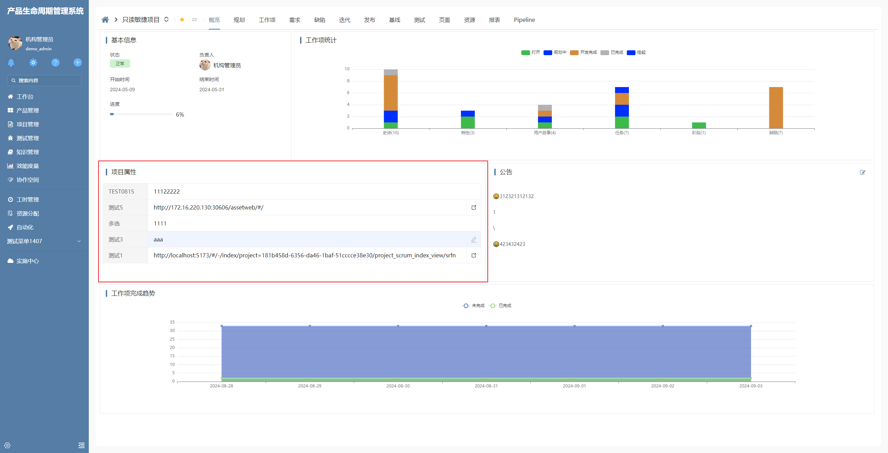
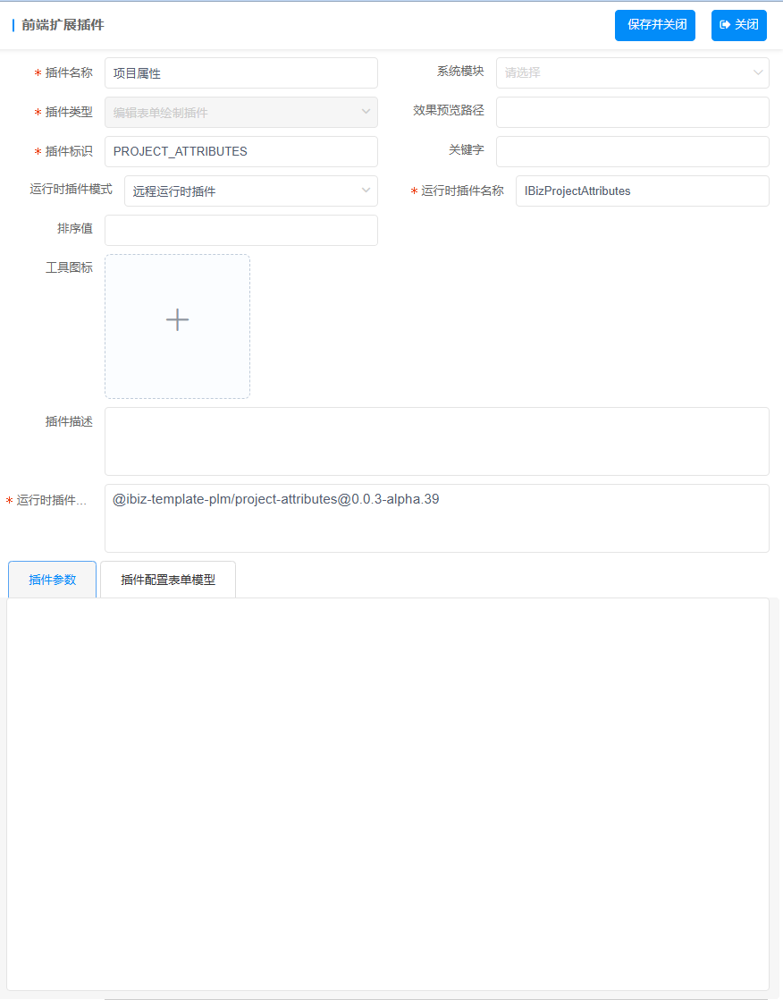

# 项目属性插件

项目属性插件基于编辑表单绘制插件增强，主要用于展示项目中扩展属性和属性值，支持多种属性类型。

## 效果呈现



## 配置

该插件隶属于编辑表单绘制插件，下方数据导入应用即可使用

::: details 点我查看代码

```json
[
  {
    "plugintype": "EDITFORM_RENDER",
    "rtobjectrepo": "@ibiz-template-plm/project-attributes@0.0.3-alpha.39",
    "codename": "UsrPFPlugin0627666393",
    "plugintag": "PROJECT_ATTRIBUTES",
    "rtobjectmode": 2,
    "rtobjectname": "IBizProjectAttributes",
    "pssyspfpluginname": "项目属性"
  }
]
```

:::

插件配置截图



### 功能说明

- 展示项目中的扩展属性
- 支持多种属性类型
- 属性值以http:// 或 https:// 开头,展示链接标识
