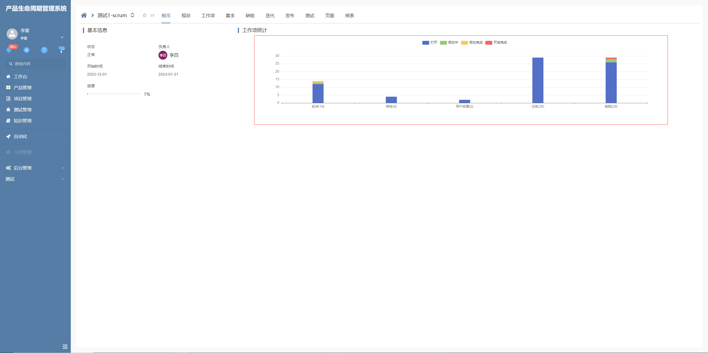

# 图表自定义 label

该插件是基于图表的增强，主要是用于自定义图表的 label，**该插件隶属于图表绘制插件（基于图表进行扩展）**

## 页面展示




## 功能说明

- 计算图表堆叠柱状图的总数并显示在 label 上

## 附录

### 图表自定义 label 插件

```json
[
  {
    "plugintype": "CHART_RENDER",
    "rtobjectrepo": "@ibiz-template-plm/custom-label@0.0.2-dev.55",
    "codename": "UsrPFPlugin0204362723",
    "plugintag": "CUSTOM_LABEL",
    "rtobjectmode": 2,
    "rtobjectname": "CustomLabelProvider",
    "pssyspfpluginname": "自定义图表label"
  }
]
```
