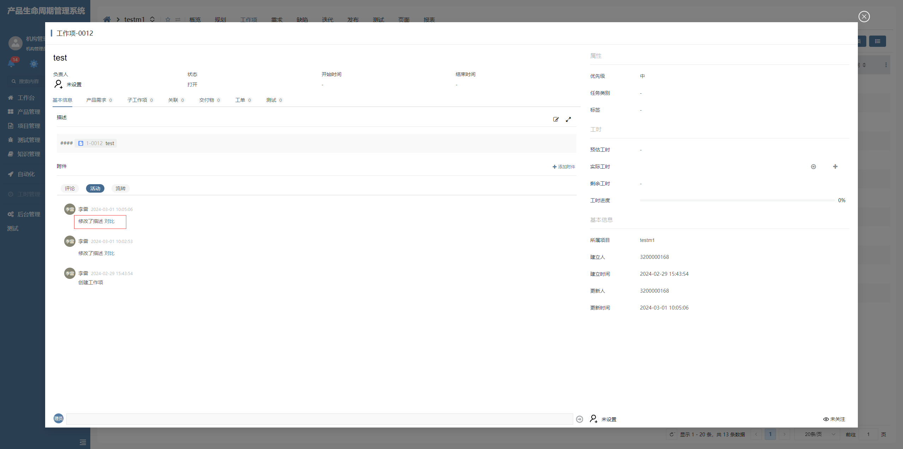

# 直接内容活动

该插件基于直接内容增强，主要是通过handlebars解析后端返回的数据，将生成的html动态绑定对比事件，并且能够通过对比事件打开弹框对比描述的新值与旧值。**该插件隶属于编辑器自定义绘制插件（基于直接内容编辑器进行扩展）**


## 页面展示




## 应用场景

用于活动页面，直接内容项上，对【步骤】和【描述】的变更提供新旧值对比功能


## 功能说明

- handlebars解析后端返回的数据生成html

- 绑定对比事件打开弹框

- 内置了onContrast函数，用于打开新旧值对比模态


## 输入参数

| 属性         | 类型        | 默认值  | 说明                                 |
| ----------- | ----------- | ------- | ------------------------------------ |
| contenttype | string      | TEXT    | 返回数据的内容类型                    |
| template    | string      | ---     | handlebars内容，用于将值解析为html文档 |


### 配置示例

```
contenttype=HTML
template={{#each this as | item |}}<div class='activity-item'><div class='activity-item--caption'>修改了{{#if item.logicname}}{{item.logicname}}{{else}}{{item.dataauditdetailname}}{{/if}} {{#or (eq item.dataauditdetailname 'STEPS') (eq item.dataauditdetailname 'PRECONDITION') (eq item.dataauditdetailname 'DESCRIPTION')}}<span class='activity-item--contrast' click='onContrast(`{{item.dataauditdetailname}}`)'>对比</span>{{/or}}</div>{{#and (neq item.dataauditdetailname 'STEPS') (neq item.dataauditdetailname 'PRECONDITION') (neq item.dataauditdetailname 'DESCRIPTION')}}<div class='activity-item--description'><span class='activity-item--oldvalue'>{{#if item.oldtext}}{{item.oldtext}}{{else}}{{#if item.oldvalue}}{{item.oldvalue}}{{else}}无{{/if}}{{/if}}</span><ion-icon name='arrow-forward-outline'></ion-icon><span class='activity-item--newvalue'>{{#if item.newtext}}{{item.newtext}}{{else}}{{#if item.newvalue}}{{item.newvalue}}{{else}}无{{/if}}{{/if}}</span></div>{{/and}}</div>{{/each}}
```


## 附录

### 直接内容活动插件

```json
[
  {
    "plugintype": "EDITOR_CUSTOMSTYLE",
    "rtobjectrepo": "@ibiz-template-plm/raw-activity@0.0.2-dev.136",
    "codename": "UsrPFPlugin0227987407",
    "plugintag": "RAW_ACTIVITY",
    "rtobjectmode": 2,
    "rtobjectname": "IBizRawActivity",
    "pssyspfpluginname": "直接内容活动"
  }
]
```

### 编辑器样式

```json
[
  {
    "codename": "RAW_ACTIVITY",
    "pssyspfpluginid": "UsrPFPlugin0227987407",
    "repdefault": 0,
    "validflag": 1,
    "pssyseditorstylename": "直接内容（活动）",
    "pseditortypeid": "RAW"
  }
]
```
