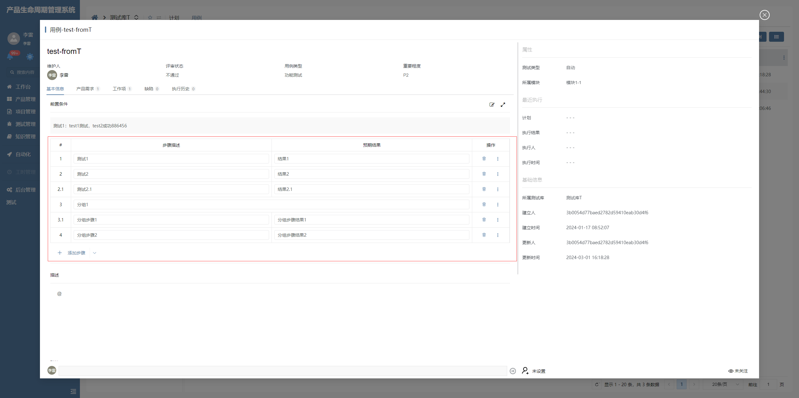

# 用例步骤重复器

该插件基于表单重复器增强，主要是新增了支持分组、排序、复制、新建默认值、动态逻辑等功能。**该插件隶属于表单自定义控件绘制插件（基于表单重复器进行扩展）**


## 页面展示




## 功能说明

### 新建默认值功能

- 重复器表格默认没有支持新建默认值，此处应支持

### 添加步骤

- 直接添加步骤时分组id为空
- 分组下添加步骤时分组id为父分组

### 添加子步骤

- 在当前数据下添加一个子步骤，只有分组或顶级步骤才有该功能

### 添加分组

- 添加分组时自动添加一个子步骤
- 设置分组id与是否分组为true

### 删除

- 删除步骤为默认删除
- 删除分组时应删除其所有子项

### 复制

- 复制步骤时判断是否存在分组id，如存在应拷贝
- 复制分组时应复制分组及其所有子项
- 复制分组时分组id应替换，分组子项对应的分组id应同时替换

### 向上（向下）添加步骤

- 分组无向上（向下）添加步骤
- 步骤分组id应一致

### 转换为分组

- 将步骤转换为分组，只有顶级步骤有该功能


##  输入参数

| 属性名      | 描述                                                         | 类型   | 默认值   |
| ----------- | ------------------------------------------------------------ | ------ | -------- |
| groupField  | 判断数据是否为分组数据的标识属性                             | string | is_group |
| parentField | 父分组标识属性，当数据存在该属性对应的值，即该数据为分组下步骤数据 | string | group_id |
| entityKey   | 实体主键标识属性，即数据的主键                               | string | id       |


## 暴露方法

| 名称              | 说明                                           | 参数                                               |
| -------------------- | ---------------------------------------------- | -------------------------------------------------- |
| batchSetColumnData   | 批量操作列数据, 将当前列数据通过列标识替换为指定值 | 2个参数，分别是表格列标识, 当前列需要替换的值          |


## 基本使用

在具体项目中，先通过模型导入前端界面插件，然后在具体的表单中添加一个重复器表格，扩展插件选择用例步骤。


## 附录：

### 用例步骤重复器插件

```json
[
  {
    "plugintype": "FORM_USERCONTROL",
    "rtobjectrepo": "@ibiz-template-plm/repeater-grid-case-steps@0.0.2-dev.69",
    "codename": "UsrPFPlugin1218706235",
    "plugintag": "CASE_STEPS",
    "rtobjectmode": 2,
    "rtobjectname": "IBizRepeaterGridCaseSteps",
    "pssyspfpluginname": "用例步骤"
  }
]
```
