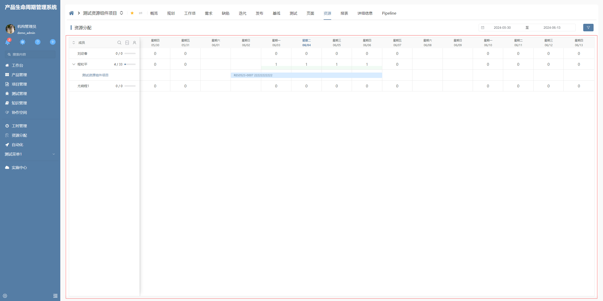

# 资源甘特图

该插件基于甘特图增强，主要是将其定制化为资源甘特图的样式，通过扩展样式来丰富视觉效果，并重新定义了用户界面（UI）的逻辑。**该插件隶属于树视图绘制插件（基于甘特图进行扩展）**


## 页面展示




## 功能说明

### 插件采用非传统的甘特图样式，提供一套独特的视觉界面

### 自定义滑块拖拽功能

- 允许通过配置选项来开启或关闭滑块的拖拽功能

### 滑块拖拽按天计算

- 当移动或拖拽滑块时，插件将自动以天为单位进行计算，确保时间线的精度和准确性

### 基于分组属性的单元格合并

- 插件支持基于groupField属性对单元格进行合并

### 自定义时间范围显示

- 可以自定义显示的时间范围，按天选择自定义的特定时间段

### 自定义滑块显示主信息内容

- 插件允许用户配置滑块上显示的主要信息内容


## 输入参数

| 参数              | 类型     | 默认值                         | 说明                                 |
| ----------------- | ------- | ----------------------------- | ------------------------------------ |
| SLIDERDRAGGABLE   | boolean | true                          | 是否开启滑块拖拽（部件控件动态参数配置）|
| SLIDERSHOWCONTENT | string | "${show_identifier}  ${title}" | 滑块显示内容映射（部件控件动态参数配置）|
| GROUPCONFIG       | string | { groupField: 'project_id' }   | 分组配置（部件控件动态参数配置）        |
| SLIDERLIMIT       | boolean | true                          | 滑块限制（部件控件动态参数配置）        |
| EXPANDALL         | boolean | false                          | 全部展开（部件控件动态参数配置）        |


## 附录

### 资源甘特图插件

```json
[
  {
    "plugintype": "TREE_RENDER",
    "rtobjectrepo": "@ibiz-template-plm/resource-gantt@0.0.3-dev.208",
    "codename": "UsrPFPlugin0529272773",
    "plugintag": "RESOURCE_GANTT",
    "rtobjectmode": 2,
    "rtobjectname": "IBizResourceGanttControl",
    "pssyspfpluginname": "资源甘特图"
  }
]
```

### 资源状态插件

```json
[
  {
    "plugintype": "CUSTOM",
    "codename": "UsrPFPlugin0603703380",
    "plugintag": "RESOURCE_STATE",
    "pssyspfpluginname": "资源状态"
  }
]
```
