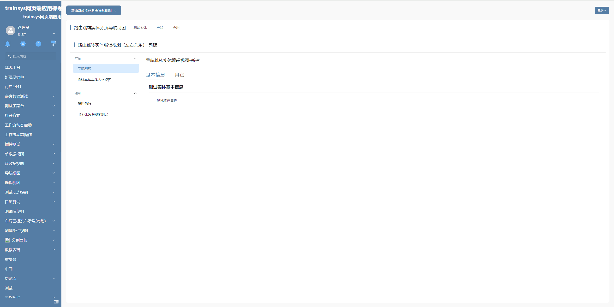
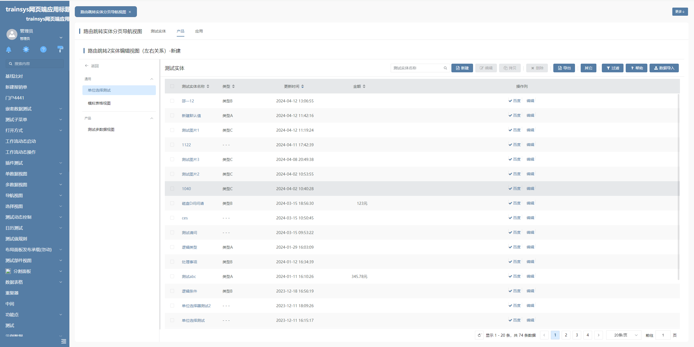
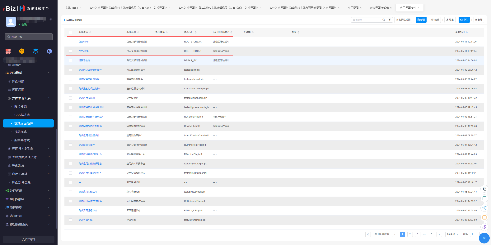
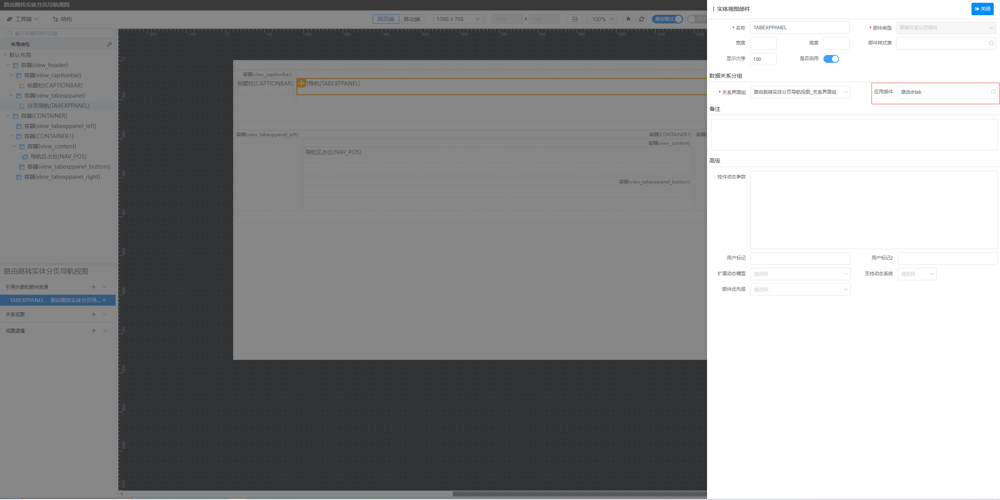
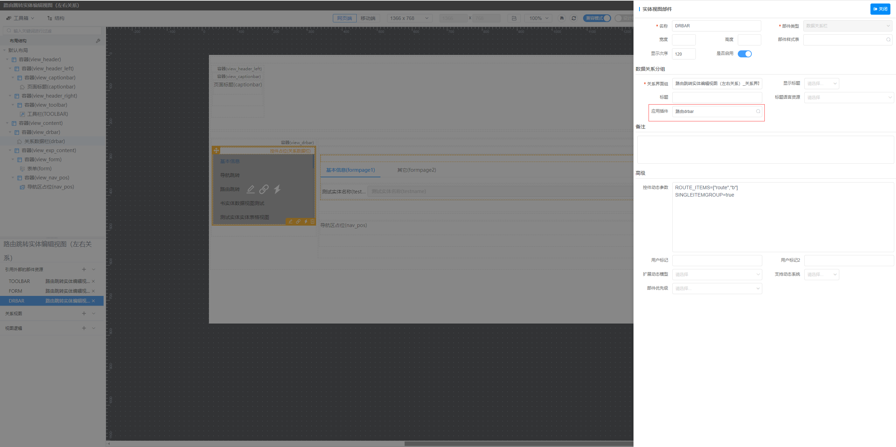
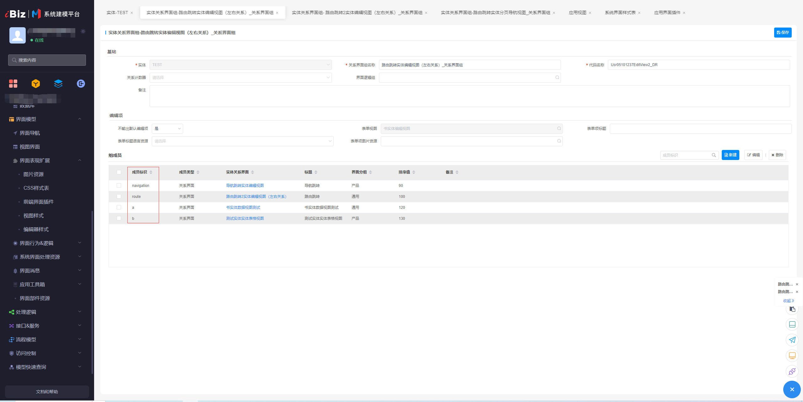

# 路由导航插件

该插件基于数据关系栏和数据分页栏，扩展了其对应的路由跳转功能。

## 页面展示

## 功能说明

- 点击菜单项，进行路由跳转或导航
- 点击tab项，回到默认呈现视图
- 点击返回按钮，跳转到对应的视图

## 基本使用

在具体项目中，先通过模型导入前端界面插件，然后在对应部件中配置插件，路由drtab和路由drbar插件需要配合使用。然后配置对应的控件动态参数，开启扩展功能。

## 控件动态参数

扩展功能通过控件动态参数进行控制，具体参数如下：

|    参数     |                            描述                            |                 值                 |             配置示例             |
| :---------: | :--------------------------------------------------------: | :--------------------------------: | :------------------------------: |
| ROUTE_ITEMS | 需要进行路由跳转的关系界面，未在配置数组里面则默认进行导航 | JSON数组，数组项为关系界面成员标识 |    ROUTE_ITEMS=["route","b"]     |
| ENABLE_BACK |                      是否启用返回按钮                      |               布尔值               |         ENABLE_BACK=true         |
|   VIEW_ID   |              返回按钮点击后，跳转视图对应的id              |           字符串，视图id           | VIEW_ID=testusr05101237editview2 |
