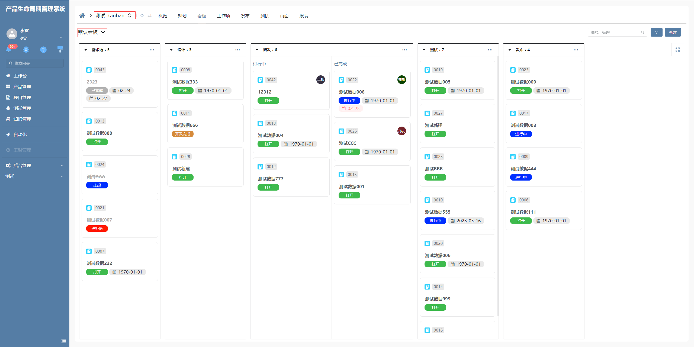
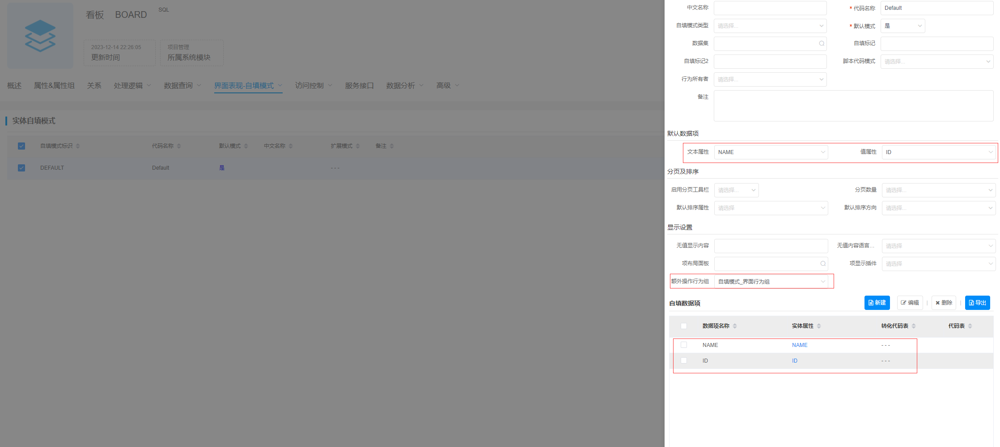

# 数据选择（路由）

该插件基于数据选择增强，主要是实现了选择项目后跳转对应的项目主视图，同时支持搜索、自填模式界面行为组等功能。**该插件隶属于编辑器自定义绘制插件（基于数据选择进行扩展）**


## 页面展示




## 功能说明

### ac搜索

- 根据ENABLESEARCH参数控制是否启用ac
- 支持上下选择，回车选中

### 改变路由模式

- 识别MODE参数为ROUTECHANGE时启用该模式
- 如果视图面板上配置了重定向视图引用时，直接打开对应的重定向视图，如果没有，则直接进行路由跳转，且将路由层级后续的路由信息删除

### 改变上下文模式

- 识别MODE参数为CONTEXTCHANGE时启用该模式

- 选中数据后，将选中数据的id赋值给当前路由层级的上下文中，不截断后续路由信息


## 输入参数

| 属性名       | 描述         | 类型                      | 默认值      |
| ------------ | ------------ | ------------------------- | ----------- |
| ENABLESEARCH | 是否允许搜索 | boolean                   | false       |
| SUFFIX       | 后缀图标     | string                    | ——          |
| ROUTEKEY     | 路由属性标识 | string                    | ——          |
| MODE         | 值变更模式   | ROUTECHANGE/CONTEXTCHANGE | ROUTECHANGE |

路由属性标识（ROUTEKEY）默认为实体主键，将会根据其对路由路径进行匹配，已确认当前路由主键信息

值变更模式（MODE）为ROUTECHANGE时，选中数据后将会打开对应重定向视图，然后由重定向视图去打开对应视图，为CONTEXTCHANGE，会将选中的信息添加到路由上后打开路由。

注：本插件目前只支持自填模式的形式，且自填模式上的额外操作行为组将会绘制在选项列表下方




## 基本使用

在具体项目中，先通过模型导入编辑器插件和前端界面插件，然后在具体的视图配置动态文本，然后将其编辑器类型改为数据选择，编辑器类型选择“数据选择（路由）”

## 附录：

### 数据选择（路由）插件

```json
[
  {
    "plugintype": "EDITOR_CUSTOMSTYLE",
    "rtobjectrepo": "@ibiz-template-plm/route-picker@0.0.2-dev.151",
    "codename": "UsrPFPlugin1221870059",
    "plugintag": "ROUTE",
    "rtobjectmode": 2,
    "rtobjectname": "IBizRoutePicker",
    "pssyspfpluginname": "数据选择（路由）"
  }
]
```

### 编辑器样式
```json
[
  {
    "codename": "ROUTE",
    "pssyspfpluginid": "UsrPFPlugin1221870059",
    "repdefault": 0,
    "validflag": 1,
    "pssyseditorstylename": "数据选择（路由）",
    "pseditortypeid": "PICKER"
  }
]
```


