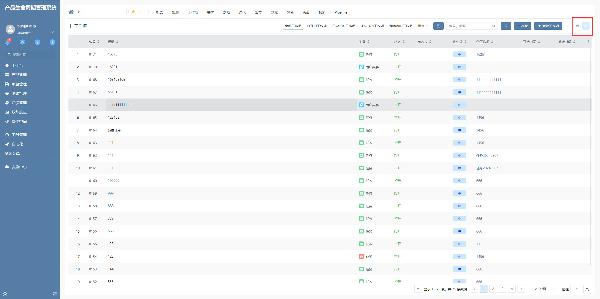

# 显示模式切换工具栏项插件

该插件基于工具栏项增强，主要是用于序号表格插件树状模式及平铺模式显示的切换。

## 页面展示

## 功能说明

### 界面逻辑调用序号表格插件切换

- 需要在工具栏项上配置界面行为

- 该插件水平呈现树状和平铺两种状态，点击对应状态后，会将树状或平铺对应的映射值合到处理界面逻辑的参数中，再执行界面逻辑

### 呈现状态存储

- 点击对应呈现状态后，会将状态存储在localStorage中，存储的key为 `SHOW_MODE_${产品id}_${视图codeName}`，首次渲染时，会通过localStorage存储的值设置默认激活状态

