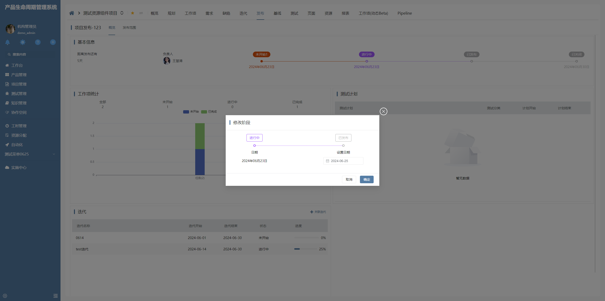

# 阶段进度条

该插件基于标签（数据链接）增强，主要是用于发布阶段信息的清晰展示。它精心设计了只读态和操作态下的不同UI效果，以提升用户体验并适应不同使用场景。**该插件隶属于编辑器自定义绘制插件（基于标签（数据链接）编辑器进行扩展）**


## 页面展示




## 功能说明

### 特殊的ui效果

- 在只读状态下，用户可以查看详细的阶段信息，并且通过点击阶段状态标签，直接打开与之关联的数据链接视图

- 当进入操作状态时，界面将展示可编辑的UI元素。插件支持根据可操作属性值绘制日期编辑器，允许用户根据需求选择或编辑日期

### 日期选择范围限制

- 插件还提供了日期选择范围限制的功能，确保用户在选择日期时，只能在预设的日期范围内进行选择，避免选择无效或不符合业务逻辑的日期


## 输入参数

| 属性                | 类型        | 默认值  | 说明                                 |
| ------------------- | ----------- | ------- | ------------------------------------ |
| RELEASESTAGEIDFIELD | string      | ---    | 发布阶段标识属性，用于传递到打开的数据链接视图的视图参数中                    |
| CLICKSTAGEIDFIELD   | string      | ---   | 点击阶段标识属性，用于传递到打开的数据链接视图的视图参数中             |
| DATESHOWCONFIG      | Object      | {"fieldName": "operated_time","format": "YYYY年MM月DD日"}     | 日期显示属性及格式化配置             |
| ISOPERATEFIELD      | string      | ---     | 是否可操作属性             |
| SHOWCONFIG          | Object      | {"sort": "p_sequence","typeName":"pname","color":"p_color"}     | 内容显示相关属性配置             |
| DATERANGE           | Object      | {"startField": "date_gt","endField": "date_lt"}     | 日期范围属性配置             |


## 配置示例

### 只读配置

```
readonly=true
```


## 附录

### 阶段进度条插件

```json
[
  {
    "plugintype": "EDITOR_CUSTOMSTYLE",
    "rtobjectrepo": "@ibiz-template-plm/stage-progress-bar@0.0.3-dev.259",
    "codename": "UsrPFPlugin0620643299",
    "plugintag": "STAGE_PROGRESS_BAR",
    "rtobjectmode": 2,
    "rtobjectname": "IBizStageProgressBar",
    "pssyspfpluginname": "阶段进度条"
  }
]
```

### 编辑器样式

```json
[
  {
    "codename": "STAGE_PROGRESS_BAR",
    "pssyspfpluginid": "UsrPFPlugin0620643299",
    "repdefault": 0,
    "validflag": 1,
    "pssyseditorstylename": "阶段进度条",
    "pseditortypeid": "SPAN_LINK"
  }
]
```
