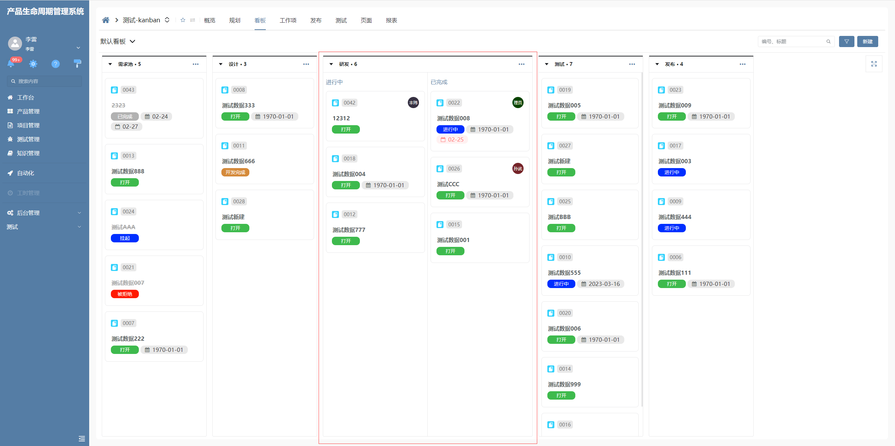

# 步骤看板

该插件基于看板部件增强，主要是适配看板分组后再次进行分组的情况，并且再次分组后的看板必须与默认看板拥有一样的功能。**该插件隶属于自定义部件绘制插件（基于看板部件进行扩展）**


## 页面展示




## 功能说明

### 隐藏默认新建工具栏

- 将分组看板上的默认新建按钮隐藏

### 分组步骤

- 当代码表数据中存在is_split为1，对分组进行步骤分割，看板数据entry_status为1时为进行中，entry_status为2为已完成。


## 基本使用

在具体项目中，先通过模型导入看板插件，然后在具体的视图中给看板选择对应的扩展。


## 附录：

### 看板插件

```json
[
  {
    "plugintype": "CUSTOM",
    "rtobjectrepo": "@ibiz-template-plm/steps-kanban@0.0.2-alpha.14",
    "codename": "UsrPFPlugin1220006725",
    "plugintag": "STEPS_KANBAN",
    "rtobjectmode": 2,
    "rtobjectname": "IBizStepsKanbanControl",
    "pssyspfpluginname": "步骤看板"
  }
]
```
