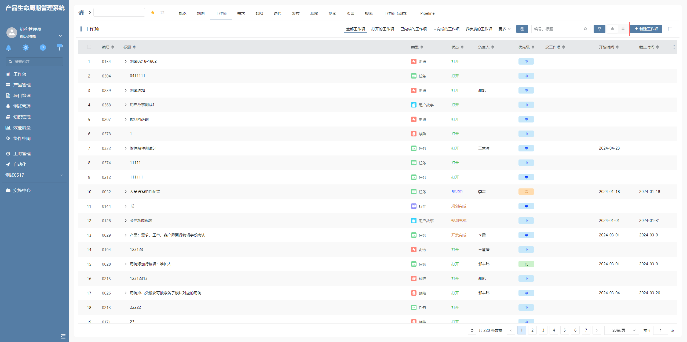

# 切换显示模式

该插件基于面板项自定义按钮增强，主要是用于序号表格插件树状模式及平铺模式显示的切换。**该插件隶属于自定义部件绘制插件（基于面板项自定义按钮进行扩展）**

## 页面展示



## 功能说明

### 界面逻辑调用序号表格插件切换

- 需要在面板项自定义按钮上配置界面行为

- 该插件水平呈现树状和平铺两种状态，点击对应状态后，会将树状或平铺对应的映射值合到处理界面逻辑的参数中，再执行界面逻辑

### 呈现状态存储

- 点击对应呈现状态后，会将状态存储在localStorage中，存储的key为 `SHOW_MODE_${产品id}_${视图codeName}`，首次渲染时，会通过localStorage存储的值设置默认激活状态

## 附录

### 切换显示模式插件

```json
[
  {
    "plugintype": "CUSTOM",
    "rtobjectrepo": "@ibiz-template-plm/switch-show-mode@0.0.2-dev.151",
    "codename": "UsrPFPlugin0123395479",
    "plugintag": "SWITCH_SHOW_MODE",
    "rtobjectmode": 2,
    "rtobjectname": "IBizSwitchShowModeButton",
    "pssyspfpluginname": "切换显示模式"
  }
]
```
