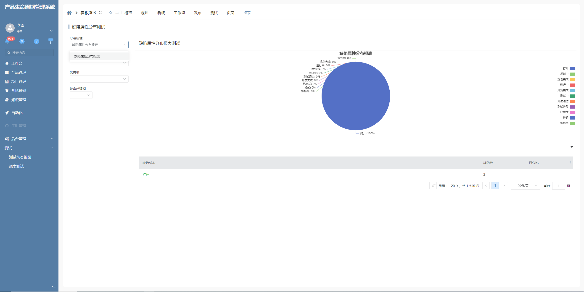
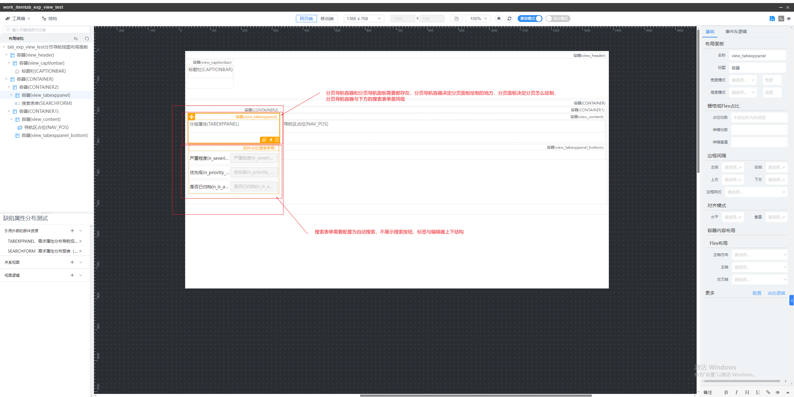

# 分页导航下拉

该插件基于分页导航（DRTAB）的增强，主要是用于将分页导航的分页以下拉形式展现，配合配置的搜索表单，值变化时能同步刷新配置的导航视图里面的表格和图表。**该插件隶属于自定义部件绘制插件（基于分页导航进行扩展）**


## 示例展示




## 功能说明

- 支持以下拉的形式展现分页导航的分页

- 配置了搜索表单后档搜索表单值变更后会同时按搜索条件重新加载被激活的导航视图里面的表格和图表


## 配置说明

在配置分页导航视图时，导航栏与导航区要为左右形式，具体结构如下：




## 附录

### 分页导航下拉插件

```json
[
  {
    "plugintype": "CUSTOM",
    "rtobjectrepo": "@ibiz-template-plm/tab-exp-select@0.0.2-dev.151",
    "codename": "UsrPFPlugin0312154007",
    "plugintag": "TAB_EXP_SELECT",
    "rtobjectmode": 2,
    "rtobjectname": "TabExpSelect",
    "pssyspfpluginname": "分页导航下拉"
  }
]
```

