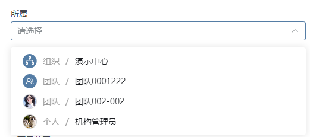

# 团队选择器

该插件基于数据选择器增强，主要用于在团队数据集中选择指定团队，或者选择自己组织或个人。

## 页面展示



## 主要功能

* 根据是否具有ORG_M权限决定是否显示组织选项
* 根据是否配置了指定编辑器参数决定是否显示个人选项

## 输入参数

| 参数         | 类型       | 默认值                                                       | 说明                                                         |
| ------------ | ---------- | ------------------------------------------------------------ | ------------------------------------------------------------ |
| fillMap      | JSON字符串 | {"user":"user","user_group":"user_group","organization":"organization"} | 编辑器参数，作为选中的值与配置的组织，团队，个人代码表的映射 |
| enablePerson | boolean    | false                                                        | 编辑器参数，为true时显示个人选项，为false时不显示            |

注：获取团队数据需要配置实体和数据集


## 附录

### 编辑器插件

```
[
  {
    "plugintype": "EDITOR_CUSTOMSTYLE",
    "rtobjectrepo": "@ibiz-template-plm/team-picker@0.0.3-dev.89",
    "codename": "UsrPFPlugin0423179676",
    "plugintag": "TEAM_PICKER",
    "rtobjectmode": 2,
    "rtobjectname": "TeamPicker",
    "pssyspfpluginname": "团队选择"
  }
]
```

### 编辑器样式

```
[
  {
    "codename": "TEAM_PICKER",
    "pssyspfpluginid": "UsrPFPlugin0423179676",
    "repdefault": 0,
    "validflag": 1,
    "pssyseditorstylename": "团队选择",
    "pseditortypeid": "PICKER"
  }
]
```


