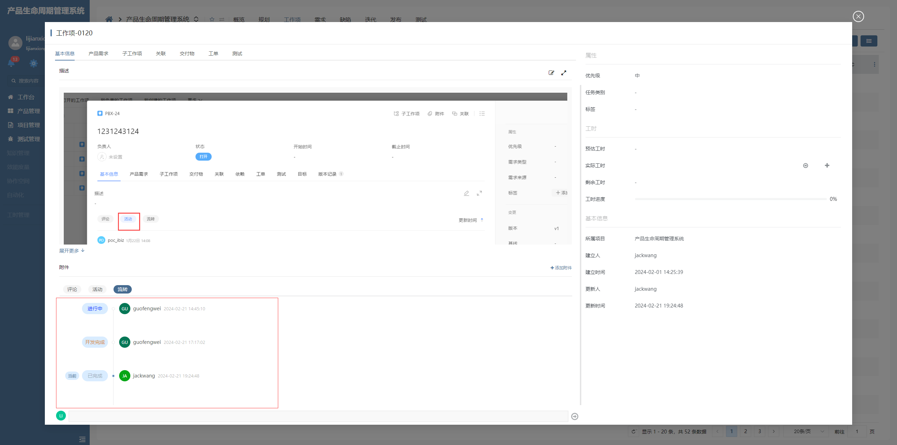

# 过渡时间线

该插件基于日历部件增强，主要是重写了日历时间线显示样式。**该插件隶属于自定义部件绘制插件（基于日历部件进行扩展）**


## 页面展示




## 功能说明

- 特有Ui样式

- 支持面板项配置


## 附录

### 过渡时间线插件

```json
[
  {
    "plugintype": "CUSTOM",
    "rtobjectrepo": "@ibiz-template-plm/transition-time-line@0.0.2-dev.94",
    "codename": "UsrPFPlugin0219522355",
    "plugintag": "TRANSITION_TIME_LINE",
    "rtobjectmode": 2,
    "rtobjectname": "IBizTransitionTimeLine",
    "pssyspfpluginname": "过渡时间线"
  }
]
```

