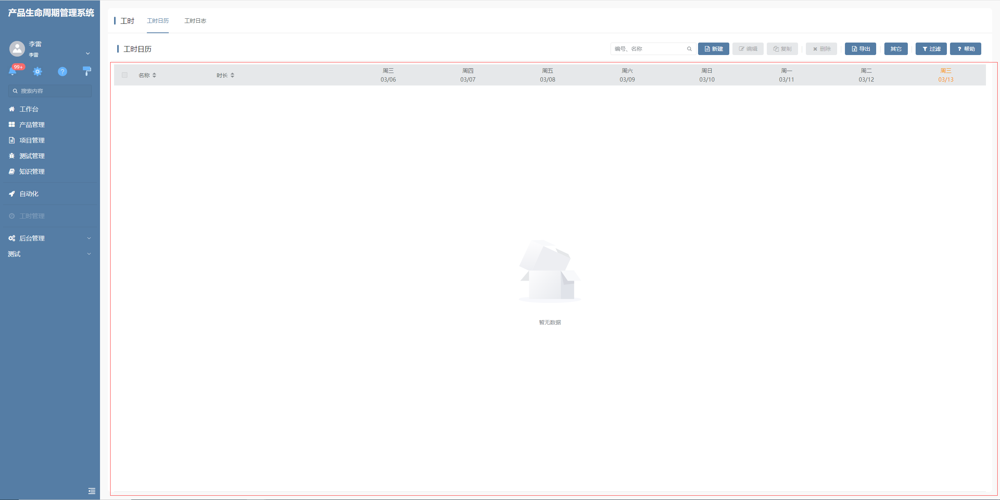

# 工时表格

该插件基于表格部件增强，主要是用来显示工时日历，通过指定识别的搜索表单项作为时间范围，以此来绘制甘特列数据。**该插件隶属于数据表格绘制插件（基于表格部件进行扩展）**


## 页面展示




## 功能说明

- 主要使用场景为显示工时日历，工时表格特殊识别控件动态参数【DATERANGE】，以此来指定识别的搜索表单项作为时间范围，以此来绘制甘特列数据


## 输入参数

### 新增输入

| 属性        | 类型         | 默认值 | 说明                                          |
| ----------- | ----------- | ------ | --------------------------------------------- |
| DATERANGE   | string      | ---    | 表格控件动态参数，指定对应的搜索项的值作为时间范围 |


### 配置示例

```
DATERANGE=date_range
```

## 数据聚合
该表格插件将原表格的表格分组模型用于识别为数据聚合，将分组属性一致的数据项聚合为一项，便于统计工时信息

## 附录

### 工时表格插件

```json
[
  {
    "plugintype": "GRID_RENDER",
    "rtobjectrepo": "@ibiz-template-plm/workload-table@0.0.2-dev.150",
    "codename": "UsrPFPlugin0311767411",
    "plugintag": "WORKLOAD_TABLE",
    "rtobjectmode": 2,
    "rtobjectname": "IBizWorkloadTableControl",
    "pssyspfpluginname": "工时表格"
  }
]
```
